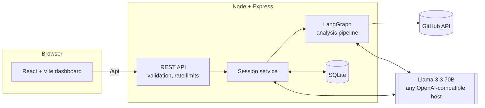
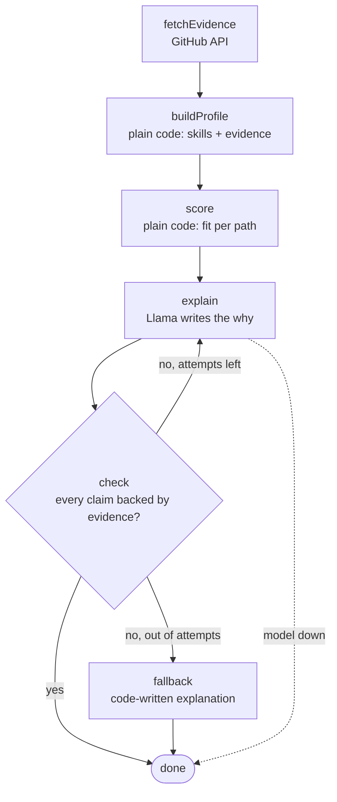
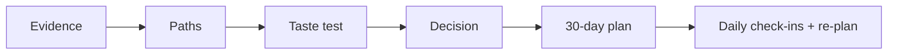

# Trailhead

> **Try the path before you pick it.**
> An evidence-based placement guide for final-year students who don't want to grind DSA and don't know which career path fits them.

Built for the Hacktoberfest "Build for a Friend" challenge, with open-weight Llama models (swappable) at the core.

---

## The problem

Final-year students are told two things: "start LeetCode" and "pick a role". Many people hear that and freeze.

| # | What goes wrong today | Why it stays unsolved |
|---|---|---|
| 1 | **They don't know which path fits them.** Web, QA, data, DevOps, support, AI apps: the options are blurry. | Career quizzes ask what you *say* you like. People answer them badly. |
| 2 | **"Just do DSA" is the only advice they get.** | Generic advice ignores what the student has already built. |
| 3 | **They can't tell what they would enjoy** until they try it. | Reading about a role is not the same as doing a small piece of it. |
| 4 | **Plans fall apart.** A study plan made once is dead after a missed week. | Static checklists don't adapt. |
| 5 | **AI advice can be confidently wrong.** A chatbot may praise skills the student never showed. | Nothing checks the model's claims against evidence. |

## What Trailhead does about it

1. **Reads your real work.** It studies your public GitHub repos and optional resume text, then builds a profile where *every skill carries evidence*.
2. **Scores 9 career paths in plain code.** Fit is the share of each path's weighted skills you already show. It is reproducible, so a model can't make the numbers up.
3. **Explains with a fact-checker.** A language model writes the "why it fits" text, but a checker rejects any claim not backed by your evidence and makes the model retry.
4. **Lets you try before you pick.** Three quick multiple-choice questions for each top path (about 3 minutes), graded in code (so it is instant and always consistent) with a hand-written explanation for each, and you rate how much you enjoyed it.
5. **Decides transparently.** `40% fit + 35% trial score + 25% enjoyment`, with the breakdown shown. You can override it.
6. **Builds a 30-day plan that adapts.** Daily tasks sized to your free time. Miss days, and unfinished tasks slide forward.

**Honesty rules built into the product**
- Too little evidence? It says so (`lowEvidence`) instead of guessing.
- Model down or no API key? You still get real scores with simple explanations, and the UI says why.
- Your resume text is never sent back to the browser.

---

## Architecture



### The analysis pipeline (LangGraph)



**Design rule:** code does anything that can be counted; the model only writes words, and a checker verifies the words.

### The student journey



More diagrams (data model, sequence, deployment) are in [`docs/ARCHITECTURE.md`](docs/ARCHITECTURE.md).

---

## Tech stack

| Layer | Choice | Why |
|---|---|---|
| Frontend | React 18, Vite, React Router | Fast, small, lazy-loaded pages |
| Backend | Node 22+, Express 4 | Simple, one language across the project |
| Orchestration | LangGraph.js | Retry loop with a checker, as an explicit graph |
| Model access | LangChain.js `ChatOpenAI` | One client for any OpenAI-compatible endpoint |
| Model | Any open-weight model on Groq (default `llama-3.3-70b-versatile`; tested with `openai/gpt-oss-120b`) | Open-weight, free API tier |
| Storage | SQLite via built-in `node:sqlite` | No native build step, zero setup |
| Validation | Zod | Same schemas validate requests and model output |
| Client tests | Vitest + Testing Library | Fast component tests in a simulated browser |
| Server tests | `node:test` | No test framework to install |

### Why open models matter here
- **Swappable:** change `LLM_PROVIDER` / `LLM_MODEL` in `.env` to move between Groq, a local Ollama model, or any other OpenAI-compatible host. No code changes.
- **Private by choice:** a student's resume and repos can stay on their own machine by running the model locally.
- **Free to run:** the default setup uses a free hosted tier.

> Honest note: with the default Groq setup the prompts go to a hosted API, so it is *not* offline. Local mode is supported but needs a machine that can run the model.

---

## Quick start

**Requirements:** Node 22.13 or newer (24 recommended).

```bash
npm install
cp server/.env.example server/.env     # then add your key (see below)
npm run dev                            # API on :4000, app on :5173
```

Open http://localhost:5173.

**Get a free model key:** create one at https://console.groq.com and set `GROQ_API_KEY` in `server/.env`. Which models a key can use differs per account: the server checks at startup and warns if `LLM_MODEL` isn't available (for example, Llama may not be enabled; `openai/gpt-oss-120b` is an open-weight alternative). Optionally add a `GITHUB_TOKEN` to raise GitHub's limit from 60 to 5000 requests/hour.

**Run it as one process (production style):**

```bash
npm run build      # builds the React app into client/dist
npm start          # Express serves the API and the built app on :4000
```

### Configuration

| Variable | Default | Meaning |
|---|---|---|
| `LLM_PROVIDER` | `groq` | `groq`, `ollama` or `openai` (any OpenAI-compatible host) |
| `GROQ_API_KEY` | – | Key for Groq |
| `LLM_MODEL` | provider default | e.g. `llama-3.3-70b-versatile` |
| `LLM_BASE_URL` | provider default | Point at any compatible endpoint |
| `GITHUB_TOKEN` | – | Optional, raises the GitHub rate limit |
| `PORT` | `4000` | API port |
| `DB_PATH` | `./data/trailhead.db` | SQLite file |
| `CORS_ORIGIN` | `http://localhost:5173` | Allowed browser origin in development |

---

## Project structure

```
trailhead/
├── client/                 React + Vite dashboard
│   └── src/
│       ├── pages/          Overview, Profile, Paths, TasteTest, Decision, Plan
│       ├── components/     Sidebar, shared UI
│       ├── lib/            API client, session context
│       └── styles/         Dark theme
├── server/
│   ├── src/
│   │   ├── graph/          LangGraph analysis pipeline
│   │   ├── services/       profile, scoring, explain (+checker), trials, decision, plan, sessions
│   │   ├── llm/            Model client (JSON-validated, retrying)
│   │   ├── db/             SQLite schema + repository
│   │   ├── routes/         REST API
│   │   ├── data/           skills.json, paths.json, tasks.json (edit these to extend)
│   │   └── config/         Environment validation
│   └── tests/              unit, graph, HTTP and live tests
└── docs/                   Architecture, API, development guide
```

## Testing

```bash
npm test            # server (71 tests) + client (73 tests); the 7 live tests are skipped
npm run test:live -w server   # real Groq + real GitHub (needs server/.env), a few free API calls
```

| Suite | What it covers |
|---|---|
| Server (64 run, 7 live-only) | Skill detection (including negation: "I'd rather avoid DSA" is not DSA experience), scoring, the claim checker, the retry/fallback graph, the LLM client (JSON retries, error mapping, rate-limit wait, model check), decision maths, re-planning with a shifted clock, rate limiting, oversized/malformed bodies, prompt-injection handling, and the full HTTP journey |
| Client (73) | Sidebar locking and model badge states, every page's behaviour, route gating, the API wrapper, and the animation helpers |
| Live (7) | Real analysis with every claim backed by evidence, code-graded 3-question taste tests (score = share correct, bad input rejected, answer key never sent), and a real 30-day plan that stays in the student's stack |

Server and client tests use fake GitHub and fake model clients, so they are fast and need no keys.

**What is and is not verified:** see [Verification status](docs/DEVELOPMENT.md#verification-status).

## Docs

- [Architecture](docs/ARCHITECTURE.md): diagrams, data model, design decisions
- [API reference](docs/API.md)
- [Development guide](docs/DEVELOPMENT.md): adding a path, swapping models, scaling, limits

## Limits (read these)

- Fit scores come from **public GitHub evidence and resume keywords**. They suggest, they don't judge a person. Students with few public repos get a "not enough evidence" warning.
- Taste tests are three multiple-choice questions per path, graded in code, so scoring is instant, free and identical every time (the score is the share you got right). The questions and explanations are written by hand in `server/src/data/tasks.json`. It is a quick signal, not a skills exam.
- Sessions are anonymous, and the session id in the browser is the only key. Fine for a personal tool; add real auth before a multi-user launch.
