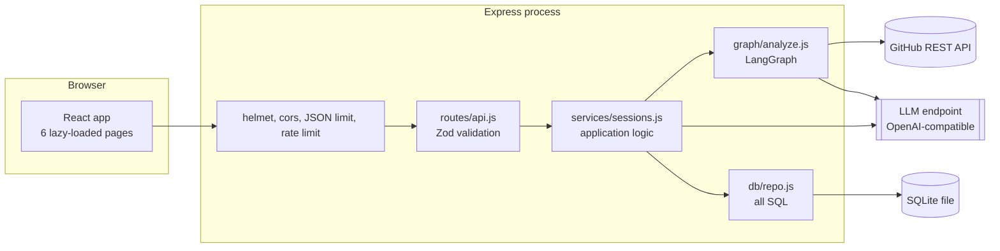
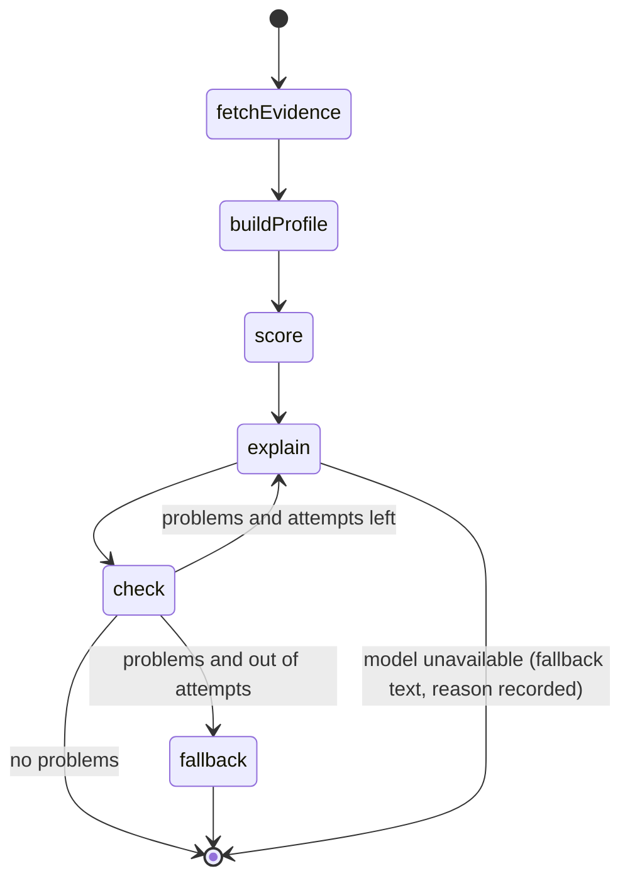
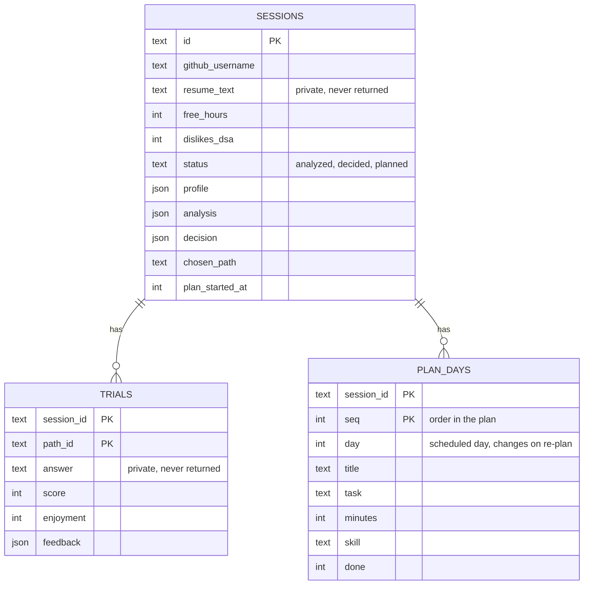
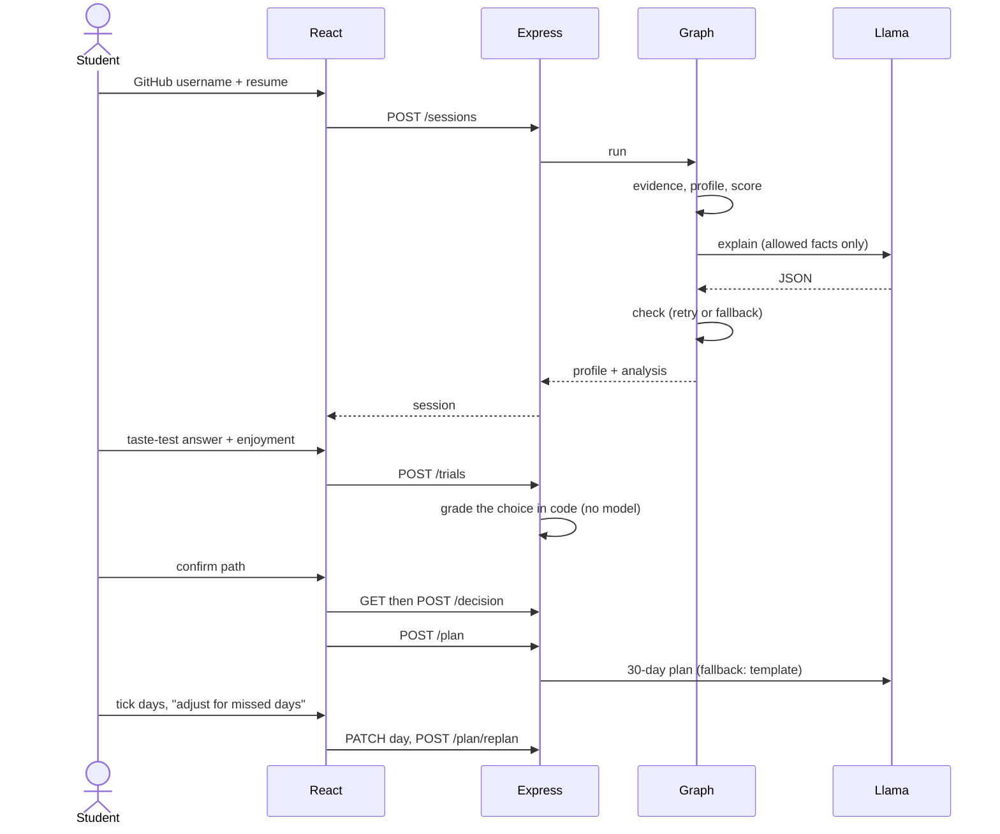

# Architecture

## 1. System overview



Layers only call downward: routes know nothing about SQL, services know nothing about HTTP, and the model client is the only code that talks to an LLM. Every dependency (database, GitHub client, model) is passed into `createApp(...)`, so tests swap in fakes.

## 2. Analysis pipeline



| Node | Kind | What it does |
|---|---|---|
| `fetchEvidence` | I/O | Public repos, languages and top-level files from GitHub (cached 10 min) |
| `buildProfile` | code | Detects skills; each skill keeps its evidence strings |
| `score` | code | Fit per path = weighted share of skills present; DSA-dislike penalty on the rank only |
| `explain` | LLM | Writes summary, strengths and gaps, using only a list of allowed facts |
| `check` | code | Rejects invented skills, evidence not copied exactly, gaps outside the missing list, summaries that boast about unrelated skills |
| `fallback` | code | Deterministic explanation that always passes the checker |

**Why a graph?** The loop (explain, check, retry with the exact problems listed, then fall back) is the only non-linear part of the system. LangGraph makes it explicit and testable. Everything else is plain functions.

### Pause and resume
The taste test can take hours. State is persisted in SQLite between HTTP requests (sessions, trials, decision, plan), so the flow resumes after a refresh or restart. A LangGraph checkpointer is not needed for this: each step is its own request.

## 3. Decision formula

```
combined = 0.40 * fit + 0.35 * trial_score + 0.25 * enjoyment
```

`fit` is the DSA-adjusted rank score (0-100), `trial_score` is the graded task (0-100), `enjoyment` maps the 1-5 rating to 0-100. Only paths the student has tried are ranked. The weights are returned with the result and shown in the UI.

## 4. Data model



`seq` is the task's identity and order. `day` is when it is scheduled. Re-planning only rewrites `day`, so progress is never lost.

## 5. Journey sequence



## 6. Reliability rules

| Failure | Behaviour |
|---|---|
| Model returns invalid JSON | Error is fed back; up to 3 tries; then a clear 502 |
| Model returns false claims | Checker rejects, retries with the problems; then code-only fallback |
| No API key / model down during analysis | Real scores returned; basic wording; reason shown in the UI |
| Model down during grading | Nothing happens: taste tests are graded in code, so they keep working |
| Model returns a bad plan | Template plan; reason returned as `planNote` |
| GitHub user missing / rate limited | `404` / `429` with an actionable message |

## 7. Security and privacy

- `helmet` headers, a JSON body limit (100 KB), a strict CORS origin.
- Zod validation on every request body and parameter.
- Parameterised SQL only (prepared statements).
- Per-IP rate limit on endpoints that call the model or GitHub.
- The resume and trial answers are stored but **never returned** by the API.
- Taste-test answers are validated as option indices and graded in code, so there is no model prompt to inject into. The answer key and explanation never leave the server until the student has answered.
- Secrets live in `server/.env`, which is git-ignored.

## 8. Performance and scaling

| Area | Today | If it grows |
|---|---|---|
| Frontend | Route-level code splitting; the first load is ~58 KB gzipped | CDN for `client/dist` |
| GitHub | In-memory cache, repos analysed in parallel, capped at 8 | Shared cache (Redis), token pool |
| Model | The bottleneck (seconds per call); retries bounded | Queue + worker, streaming responses |
| Storage | SQLite (WAL mode), single node | Swap `db/repo.js` for Postgres. It is the only file with SQL |
| Server | Stateless (all state in the DB) | Run several instances behind a load balancer once the DB is shared |

## 9. Key decisions

| Decision | Reason |
|---|---|
| Scores in code, words from the model | Numbers must be reproducible and unforgeable |
| Evidence strings must be copied exactly | Makes "no invented claims" a mechanical check |
| Multiple-choice taste tests (3 questions per path) graded in code | Comparing numbers doesn't need a model: instant, free, never rate limited, always the same |
| `node:sqlite` instead of a native module | No build toolchain; works on any Node 22.13+ |
| JSON-in-prompt instead of provider tool calling | Works the same on Groq, Ollama and others |
| Anonymous sessions | Zero friction for a single-person tool |
